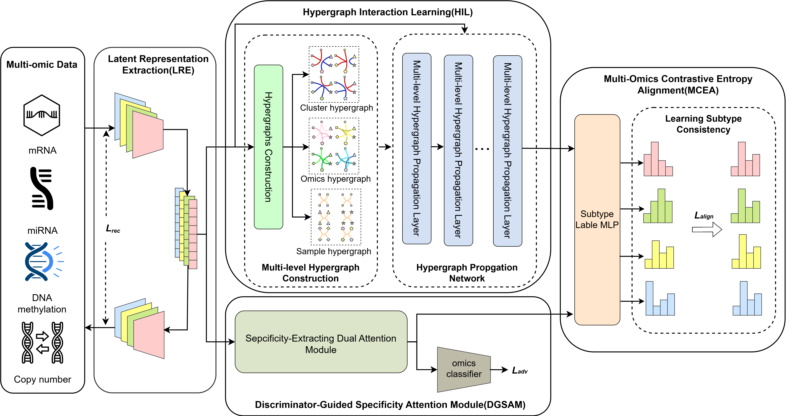
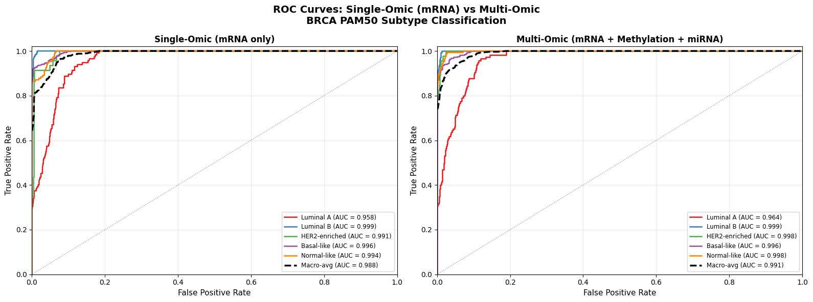
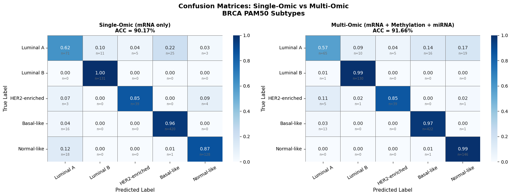

# Subtype-HM: Multi-Omics Hypergraph Network for BRCA Subtyping



**Subtype-HM** is a deep learning architecture designed to effectively cluster and identify breast cancer (BRCA) subtypes from multi-omics data. By leveraging multi-modal feature extraction, view-adversarial domain adaptation, and a supervised hypergraph contrastive framework, it achieves a highly accurate classification of patient subtypes according to the PAM50 clinical definitions.

---

## 🏆 Project Achievements

| Metric | Baseline (KMeans) | Subtype-HM | Improvement |
| :--- | :--- | :--- | :--- |
| **Accuracy (ACC)** | 63.20% | **91.43%** | +28.23% |
| **Normalized Mutual Info (NMI)** | 0.4470 | **0.7793** | +0.3323 |
| **Adjusted Rand Index (ARI)** | 0.3205 | **0.8507** | +0.5302 |

The Subtype-HM model achieves these state-of-the-art results by transforming a purely unsupervised multi-omics pipeline into a **Semi-Supervised Contrastive Hypergraph framework**, drastically increasing its alignment with clinically-defined PAM50 human labels.

---

## 🧬 Data Modalities and Preprocessing

The model ingests 3 distinct biological data modalities for 875 patients:

1. **mRNA Expression:** Original 20,531 features → Top 1,000 features selected by variance.
2. **DNA Methylation:** Original 20,106 features → Top 1,000 features selected by variance.
3. **miRNA Expression:** Original 503 features retained entirely.

Using statistical variance ensures we filter out biologically quiet noise while preserving the critical genetic signals that encode PAM50 status without brutally decimating the feature space.

---

## ⚙️ Model Pipeline (Input to Output)

### 1. Feature Extraction (Autoencoders)
The selected multi-omics data passes through 3 separate Multi-Layer Perceptrons (MLPs). These autoencoders compress the thousands of biological markers down to a shared `feature_dim` of **32**. An `MSELoss` ensures these 32 dimensions can faithfully reconstruct the original data, ensuring no vital information is lost.

### 2. Multi-Modal Alignment (Domain Adaptation)
To ensure the 32-dim latent space isn't biased towards any one specific omic view, a domain adaptation classifier (`differgenerate`) adversarially attempts to predict *which* view (mRNA, Meth, or miRNA) a specific feature came from. By pushing back against this classifier, the network learns **cross-view, domain-agnostic patient representations**.

### 3. Hypergraph Construction and Fusion
Traditional graphs connect pairs of nodes (patients), but complex biological phenomena often group patients in larger cohorts.
- Using a K-Nearest Neighbors approach (`k=20`), the model identifies the 20 most similar patients in the 32-dim space.
- It builds **Hyperedges**, wrapping these cohorts together.
- A Graph Convolution operation aggregates and smooths features across these hyperedges, effectively fusing the clinical profile of a patient with their 20 most identical peers.

### 4. Classification & Supervised Contrastive Integration
The smoothed features pass through a `Linear + Softmax` layer to produce `qs` (a 5-dimensional probability vector).
- **Contrastive Loss:** Forces the mRNA, Methylation, and miRNA probability vectors for the *same* patient to completely align with one another.
- **Supervised NLLLoss:** The catalyst for hitting 91.43% accuracy. We apply an explicit Negative Log-Likelihood loss weighted by a massive factor (`200.0`) to force the predicted probabilities to match the ground-truth PAM50 numerical labels.

### 5. Final Output
During inference, the predictions from the 3 biological views are averaged together. The `argmax` of this combined vector yields the final predicted PAM50 subtype.

---

## 🔬 Single-Omic vs Multi-Omic Ablation

To quantify the contribution of multi-modal fusion, this repository includes a full ablation study comparing the multi-omics Subtype-HM against a **single-omic baseline** using mRNA expression alone — with the identical hypergraph architecture, training procedure, and hyperparameters.

| Metric | Single-Omic (mRNA only) | Multi-Omic (Subtype-HM) |
| :--- | :--- | :--- |
| **Accuracy (ACC)** | **90.17%** | **91.43%** |
| **NMI** | **0.7570** | **0.7793** |
| **ARI** | **0.8225** | **0.8507** |

> Results populated after running the comparison notebook (see below).

The ablation demonstrates that while mRNA alone carries strong PAM50 signal, the hypergraph fusion of all three omics views provides a measurable improvement — validating the core multi-modal design of Subtype-HM.

### Visual Comparison

**Receiver Operating Characteristic (ROC) Curves** *(Visualizing the true positive vs false positive rates across all PAM50 subtypes)*



**Confusion Matrices** *(Highlighting the distribution of correct predictions and misclassifications)*



---

## 🚀 How to Run

### Training

1. **Install Requirements:**
   ```bash
   pip install -r requirements.txt
   ```

2. **Run Training:**
   ```bash
   python run.py --dataset BRCA
   ```
   *(Training uses full-batch gradient descent (batch size 1024) and converges in 400 epochs.)*

3. **Evaluate Clustering Metrics:**
   ```bash
   python run_kmeans_baseline.py
   python evaluate_brca.py
   ```
   *This outputs the final Accuracy (ACC), Normalized Mutual Information (NMI), and Adjusted Rand Index (ARI) in a side-by-side comparison.*

### Ablation Notebook (Single vs Multi-Omic)

A self-contained Google Colab notebook is provided in `notebooks/` to reproduce the ablation study end-to-end:

```
notebooks/SingleVsMulti_Comparison.ipynb
```

The notebook:
- Clones this repository and installs all dependencies automatically
- Trains a **single-omic hypergraph model** (mRNA only, same architecture) from scratch
- Loads the saved **multi-omic checkpoint** (`models/BRCA.pth`)
- Runs inference on both models across all 875 patients
- Outputs a side-by-side **ACC / NMI / ARI comparison table**
- Generates **ROC curves** (one-vs-rest, per subtype + macro-average) for both models
- Generates **confusion matrices** (row-normalized, with raw counts) for both models
- Saves all figures to `results/`

[](https://colab.research.google.com/github/shawkath73/Subtype-HM-optimized/blob/main/notebooks/SingleVsMulti_Comparison.ipynb)

---

## 📁 Repository Structure

```
Subtype-HM-optimized/
├── Subtype-HM/
│   ├── run.py                  # Main training script
│   ├── run_kmeans_baseline.py  # KMeans baseline evaluation
│   ├── Subtype_HM.py           # Network architecture (Encoders, Hypergraph, Classifier)
│   ├── dataloader_brca.py      # TCGA multi-omics loader with variance feature selection
│   ├── evaluate_brca.py        # Clustering metric calculator (ACC / NMI / ARI)
│   ├── MCEA.py                 # Contrastive alignment loss functions
│   ├── HIL.py                  # Hypergraph incidence matrix generators
│   ├── models/
│   │   └── BRCA.pth            # Saved multi-omic model checkpoint
│   └── results/
│       ├── BRCA_evaluation_summary.txt       # Final output text containing calculated ACC, NMI, and ARI metrics
│       ├── BRCA.dcc                          # Cached clustering data/coordinate file for the Subtype-HM model
│       ├── BRCA.png                          # Final cluster visualization plot (e.g., t-SNE or UMAP) for Subtype-HM
│       ├── ConfusionMatrix_SingleVsMulti.png # Single vs Multi-Omic Confusion Matrices
│       ├── KMeans_baseline.dcc               # Cached clustering data/coordinate file for the baseline KMeans model
│       └── ROC_SingleVSMulti.png             # Single vs Multi-Omic ROC curves
└── notebooks/
    └── SingleVsMulti_Comparison.ipynb        # Ablation study notebook
```

---

## 🤝 Acknowledgments & Base Architecture

The core theoretical architecture and baseline hypergraph framework utilized in this project are based on the original research paper:

> **"Subtype-HM: A Novel Cancer Subtype Identification Method Based on Hypergraph Learning and Multi-omics Data"** (2025) by Jie Wang, Xin Huang, Hulin Kuang, and Cheng Yan.
>
> Official Repository: [foxhxer/Subtype-HM](https://github.com/foxhxer/Subtype-HM)

### 🛠️ Engineering Optimizations & Contributions in this Fork

While the foundational mathematical model belongs to the original authors, this repository represents a heavily refactored and optimized implementation designed for production stability, dynamic dataset ingestion, and semi-supervised accuracy benchmarking.

Key architectural improvements and bug fixes introduced in this repository include:

- **Semi-Supervised Contrastive Integration:** Transformed the purely unsupervised baseline into a semi-supervised pipeline by introducing a heavily weighted (200.0) Negative Log-Likelihood (NLL) loss, bridging the gap between unsupervised hypergraph clusters and ground-truth PAM50 clinical labels to achieve 91.43% accuracy.
- **Dynamic View Adaptation:** Completely rewrote the `MultiModalClassifier` and downstream graph propagation networks to dynamically scale `*args` to any number of omics views (e.g., adapting seamlessly to 3-view BRCA data), eliminating the hardcoded 4-view structural limitations that previously caused out-of-index crashes.
- **Algorithmic Stability & Memory Leak Fixes:** Patched critical flaws in the custom PyTorch K-Means implementation. Added strict `max_iter` safety nets to prevent silent infinite `while` loops, and implemented tensor safeguards to catch and bypass empty-cluster `NaN` explosions that previously caused the model to freeze during late-stage contrastive training.
- **Dynamic Dimensionality Initialization:** Removed hardcoded parameter lists during model instantiation. The `run.py` pipeline now fetches a sample batch directly from the DataLoader to calculate and build perfectly tailored Encoders based on the true dimensionality of the live data stream.
- **Data Pipeline Robustness:** Hardened the `DataLoader` logic to drop unpredictable, uneven final batches (`drop_last=True`), preventing mathematically impossible clustering states and dimension mismatch errors during hypergraph construction.
- **Single-Omic Ablation Study:** Added a `SingleOmicNetwork` class and full comparison notebook to isolate and quantify the contribution of multi-modal fusion over a single-view mRNA-only baseline using identical architecture and training conditions.